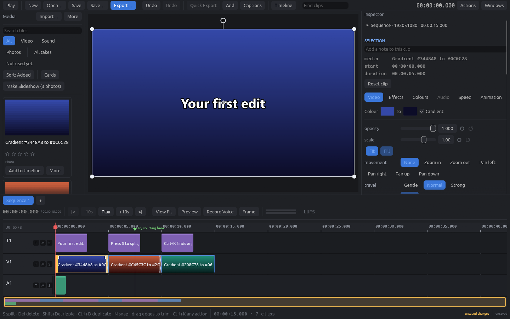

# bettercut

A free, open-source desktop video editor with CapCut-style convenience, built
in Rust to stay quick on ordinary laptops.

**[bettercut.dev](https://bettercut.dev)** · [Download](https://bettercut.dev/download/) · [Release notes](https://github.com/mentiacademyedu/bettercut/releases/tag/v0.1.0)



> **Public beta — expect bugs.** This is the first public release. It has been
> tested on two Windows PCs, a desktop and a laptop, mostly with generated test
> footage, and real-world files keep turning up problems the tests did not.
> Save often, and please
> [report what breaks](https://github.com/mentiacademyedu/bettercut/issues).
> Inside the app, **Ctrl+K → "Report a Bug on GitHub"** opens an issue with
> your version and system filled in.

## Download

**Windows 10/11, 64-bit:**
[bettercut-0.1.0-setup.exe](https://github.com/mentiacademyedu/bettercut/raw/main/dist/bettercut-0.1.0-setup.exe)
(about 50 MB). Also on the
[Releases](https://github.com/mentiacademyedu/bettercut/releases) page.

The installer is not code-signed yet, so Windows SmartScreen will say *"Windows
protected your PC"*. Click **More info → Run anyway**. It installs for your
user only (no administrator rights needed) and removes itself cleanly from
*Settings → Apps*.

macOS and Linux are not supported yet: the code is portable, but the build
scripts and the pinned FFmpeg are Windows-only for now.

## What it does

**Editing** — a multi-lane timeline with snapping, a magnetic main track,
ripple and roll edits, split, trim, slip, duplicate, copy and paste, groups,
compound clips, markers, multiple sequences, full undo history, and automatic
crash recovery. **Ctrl+K** finds actions, clips, markers and recent projects
by name, or jumps to a timecode.

**Picture** — transform with keyframes and motion paths, crop, masks (linear,
mirror, box, oval, star, heart), green-screen and luma keys, blend modes,
colour wheels, curves, HSL, LUTs, filters, blur, sharpen, glow, glitch, film
grain, vignette, light leaks, lens flare, smooth skin, stabilisation, motion
tracking, speed ramps and reverse, freeze frames, picture-in-picture, split
screens, and blurred or picture backdrops for vertical video.

**Text** — titles with styles, outlines, shadows, gradients and curved text,
entrance and exit animations (fade, slide, pop, bounce, spin, typewriter),
captions from SRT/VTT with find-and-replace, karaoke highlighting, and
title templates.

**Sound** — waveforms, volume keyframes, fades, EQ presets (voice, phone,
radio, megaphone), voice clean-up, noise gate, leveller, de-esser, one-click
**Enhance Voice**, pitch and robot voices, echo and reverb, ducking, loudness
normalisation, beat detection, silence removal, voice-over recording and
text-to-speech.

**Export** — H.264, H.265 and AV1 (on GPUs that can encode them), ProRes 422
HQ, GIF, audio-only and still frames, with presets for the usual social
platforms, an export queue, a size estimate and time remaining.

It also handles the footage phones and cameras actually produce: portrait video
and rotated photos come in upright, HDR (HLG/PQ) is tone-mapped, interlaced
video can be deinterlaced, and large files get lightweight proxies
automatically so scrubbing stays smooth.

## Coming next

- **MCP integration.** An [MCP](https://modelcontextprotocol.io) server so AI
  assistants can drive the editor: import, cut, add titles, apply looks and
  export, through the same undoable edit commands the interface uses. Every
  edit in bettercut is already a command object, which is what makes this a
  natural fit.
- Automatic captions from speech, background removal and auto-reframe (these
  need on-device models, and will be optional downloads).
- HEIC photos, code-signed installers, auto-update, and macOS/Linux builds.

## Building from source

Needs Rust (the version is pinned in `rust-toolchain.toml`) and Windows
PowerShell 5.1, which ships with Windows. No LLVM, CMake or system FFmpeg.

```powershell
# One-time setup: fetches the pinned LGPL FFmpeg SDK (~250 MB, checked
# against its SHA-256) and checks every prerequisite.
.\setup.cmd

cargo run -p bettercut-desktop              # run it
cargo test --workspace                      # the tests
.\docs\package.ps1                          # a zip and an installer in dist\
```

`.\setup.cmd check` names whatever prerequisite is missing. More detail — the
crate layout, the design rules, and what each part of the editor does and why —
is in [docs/status.md](docs/status.md), with architecture decisions in
[docs/adr](docs/adr).

## Contributing

Bug reports are the most useful thing right now: what you did, what you
expected, and the details from **Ctrl+K → Report a Bug on GitHub**. For code,
see [CONTRIBUTING.md](CONTRIBUTING.md).

## Licence

bettercut's own code is dual-licensed under [MIT](LICENSE-MIT) or
[Apache-2.0](LICENSE-APACHE), at your option.

It uses [FFmpeg](https://ffmpeg.org) under the LGPL, as separate DLLs that can
be replaced with your own build; no GPL components are linked, and the setup
script refuses FFmpeg builds that contain any. The notices for FFmpeg and for
every Rust library bettercut is built from ship with each download. Codec
patent licensing is a separate matter from software licensing and is not
addressed here.
